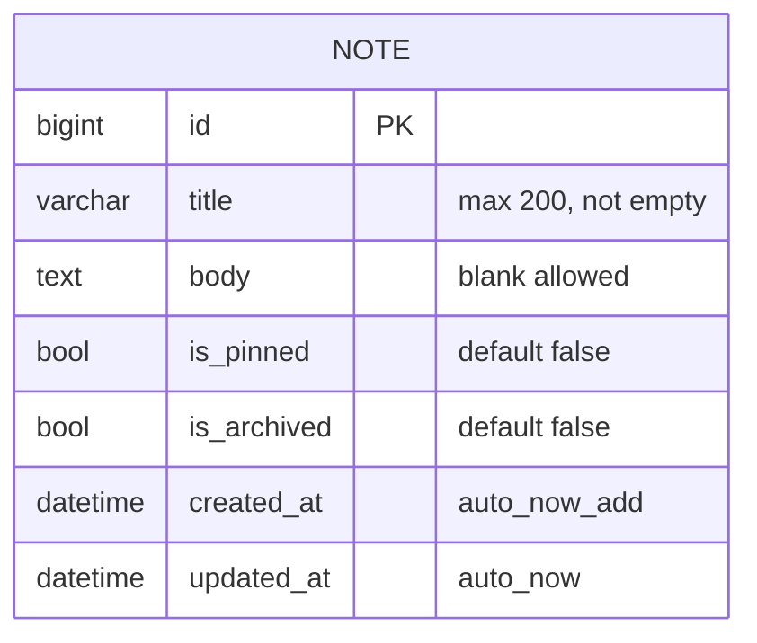
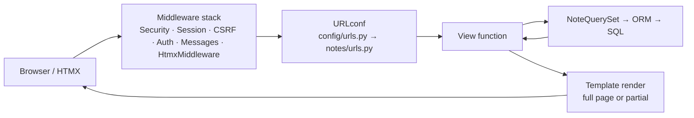

# 001. Notes App

   

## Metadata

| Field         | Value                                                 |
| ------------- | ----------------------------------------------------- |
| Difficulty    | 1/5                                                   |
| Est. time     | 3–5 h                                                 |
| Prerequisites | Python 3.12, venv/uv, Git. No prior project.          |
| Stack         | Django 5.x + Templates + HTMX (`django-htmx`)         |
| DB            | SQLite (env-swappable to Postgres via `DATABASE_URL`) |
| Auth          | None (introduced in 004)                              |

## Goal

Ship a single-user notes app end to end: project scaffold, one model, migrations, admin, function-based views, a ModelForm, template inheritance, and HTMX partial updates. This is the reference layout every later project copies: config via `django-environ`, pytest + factory_boy, ruff/black/isort, Makefile, Conventional Commits.

## What You'll Learn

- Django project vs app, `INSTALLED_APPS`, `AppConfig`
- Env-driven settings with `django-environ`
- Models, migrations (`makemigrations`, `sqlmigrate`, `migrate`), Meta options (ordering, indexes, constraints)
- Custom `QuerySet` + `as_manager()`; lazy evaluation; `Q` objects
- Django admin registration and `ModelAdmin` options
- URLconf, `include()`, URL namespaces, `reverse()` / ``
- Function-based views, `get_object_or_404`, Post/Redirect/Get, `@require_POST`
- `ModelForm`, CSRF, the messages framework
- Template inheritance, ``, autoescaping
- Middleware and `request.htmx` from `django-htmx`
- Paginator, `vary_on_headers`, query counting in tests

## Features

- Create, view, edit, delete notes (title + plain-text body)
- Pin and archive/unarchive (HTMX, no full reload)
- Live search across title and body (debounced, URL-synced)
- Pinned-first ordering, paginated list (20/page)
- Archived view
- Flash messages for full-page actions
- Admin with search, filters, date hierarchy
- `/healthz/` endpoint

## Domain Model

### `notes.Note`

| Field         | Type             | Constraints                              |
| ------------- | ---------------- | ---------------------------------------- |
| `id`          | `BigAutoField`   | PK (`DEFAULT_AUTO_FIELD`)                |
| `title`       | `CharField(200)` | required; `CheckConstraint` rejects `""` |
| `body`        | `TextField`      | `blank=True`                             |
| `is_pinned`   | `BooleanField`   | default `False`                          |
| `is_archived` | `BooleanField`   | default `False`                          |
| `created_at`  | `DateTimeField`  | `auto_now_add=True`                      |
| `updated_at`  | `DateTimeField`  | `auto_now=True`                          |

**Meta:** `ordering = ["-is_pinned", "-updated_at"]`

**Indexes:** `Index(fields=["is_archived", "-is_pinned", "-updated_at"], name="note_list_idx")`

**Constraints:** `CheckConstraint` on `title != ""`. Use `condition=` on Django 5.1+ (`check=` is deprecated).



## API Surface

Server-rendered routes. Namespace: `notes`. `HX` = returns a partial when `request.htmx`.

| Method    | Path                       | Auth  | Name            | Description                                                                  |
| --------- | -------------------------- | ----- | --------------- | ---------------------------------------------------------------------------- |
| GET       | `/`                        | none  | `notes:list`    | Paginated list. Params: `q`, `page`, `archived=1`. HX: returns list partial. |
| GET, POST | `/notes/new/`              | none  | `notes:create`  | Create form; POST → 302 to detail                                            |
| GET       | `/notes/<int:pk>/`         | none  | `notes:detail`  | Detail                                                                       |
| GET, POST | `/notes/<int:pk>/edit/`    | none  | `notes:edit`    | Edit form; POST → 302 to detail                                              |
| POST      | `/notes/<int:pk>/delete/`  | none  | `notes:delete`  | Delete. HX: 200 empty body (swap removes card). Non-HX: 302 to list.         |
| POST      | `/notes/<int:pk>/pin/`     | none  | `notes:pin`     | Toggle pin. HX: returns card partial.                                        |
| POST      | `/notes/<int:pk>/archive/` | none  | `notes:archive` | Toggle archive. HX: returns empty (card leaves the list).                    |
| GET       | `/healthz/`                | none  | `healthz`       | `{"status": "ok"}`                                                           |
| GET       | `/admin/`                  | staff | `admin:index`   | Django admin                                                                 |

## Frontend Plan

SSR with HTMX. No JS build step.

| Page   | Template                 | Notes                                            |
| ------ | ------------------------ | ------------------------------------------------ |
| List   | `notes/note_list.html`   | Extends `base.html`; search input + `#note-list` |
| Detail | `notes/note_detail.html` | Body rendered with `\|linebreaks` (escaped)      |
| Form   | `notes/note_form.html`   | Shared by create/edit                            |

| Partial    | Template                          | Used by                         |
| ---------- | --------------------------------- | ------------------------------- |
| Note list  | `notes/partials/_note_list.html`  | list view (HX), initial include |
| Note card  | `notes/partials/_note_card.html`  | list, pin response              |
| Pagination | `notes/partials/_pagination.html` | list partial                    |
| Messages   | `_messages.html`                  | `base.html`                     |

**HTMX interactions**

| Trigger        | Attributes                                                                                                 | Response          |
| -------------- | ---------------------------------------------------------------------------------------------------------- | ----------------- |
| Search input   | `hx-get`, `hx-trigger="input changed delay:300ms, search"`, `hx-target="#note-list"`, `hx-push-url="true"` | `_note_list.html` |
| Pin button     | `hx-post`, `hx-target="closest article"`, `hx-swap="outerHTML"`                                            | `_note_card.html` |
| Archive button | same target, `hx-swap="outerHTML"`                                                                         | empty 200         |
| Delete button  | `hx-post`, `hx-confirm`, `hx-target="closest article"`, `hx-swap="outerHTML"`                              | empty 200         |

**State:** server-owned. URL query params (`q`, `page`, `archived`) are the only client state. **Routing:** Django URLconf; `hx-push-url` keeps history and back button consistent.

## Architecture Notes

No queues, caches, jobs, or external APIs. One process, one DB.



| Concern              | Decision                                                                            |
| -------------------- | ----------------------------------------------------------------------------------- |
| Full page vs partial | Same URL, branch on `request.htmx`; add `Vary: HX-Request` so caches never mix them |
| Mutations            | POST only; PRG for non-HTMX                                                         |
| Business filters     | On `NoteQuerySet`, not in views                                                     |
| Config               | Env only; `.env` ignored, `.env.example` committed                                  |

## Suggested App Structure

```text
001-notes-app/
├── manage.py
├── requirements.txt
├── requirements-dev.txt
├── pyproject.toml              # ruff, black, isort, pytest config
├── Makefile
├── .env.example
├── .gitignore
├── .pre-commit-config.yaml
├── README.md
├── config/
│   ├── __init__.py
│   ├── settings.py
│   ├── urls.py
│   ├── asgi.py
│   └── wsgi.py
├── notes/
│   ├── __init__.py
│   ├── admin.py
│   ├── apps.py
│   ├── forms.py
│   ├── models.py
│   ├── urls.py
│   ├── views.py
│   ├── migrations/
│   │   └── 0001_initial.py
│   └── tests/
│       ├── __init__.py
│       ├── factories.py
│       ├── test_models.py
│       ├── test_forms.py
│       └── test_views.py
├── templates/
│   ├── base.html
│   ├── _messages.html
│   └── notes/
│       ├── note_list.html
│       ├── note_detail.html
│       ├── note_form.html
│       └── partials/
│           ├── _note_list.html
│           ├── _note_card.html
│           └── _pagination.html
└── static/
    └── css/app.css
```

## Hints & Approach

1. **Scaffold.** `python -m venv .venv && source .venv/bin/activate`, install `django`, `django-environ`, `django-htmx`. Run `django-admin startproject config .` (the trailing dot avoids a nested folder), then `python manage.py startapp notes`. _Idiom:_ a **project** is the deployable config container (settings, root URLconf, WSGI/ASGI entry). An **app** is a Python package that owns models/views/templates and is activated by listing it in `INSTALLED_APPS`. Use the dotted path `"notes.apps.NotesConfig"` (`AppConfig` is the per-app hook for startup code). Commit: `chore(001): scaffold project`.

2. **Env-driven settings.** `manage.py`, `wsgi.py` and `asgi.py` locate your settings through the `DJANGO_SETTINGS_MODULE` env var. The settings module itself is plain Python executed at startup. Wire `django-environ`:

```python
   import environ
   env = environ.Env(DEBUG=(bool, False))
   environ.Env.read_env(BASE_DIR / ".env")
   SECRET_KEY = env("SECRET_KEY")
   DEBUG = env("DEBUG")
   ALLOWED_HOSTS = env.list("ALLOWED_HOSTS", default=[])
   DATABASES = {"default": env.db("DATABASE_URL", default="sqlite:///db.sqlite3")}
```

`BASE_DIR` is a `pathlib.Path`. Set `TEMPLATES[0]["DIRS"] = [BASE_DIR / "templates"]` and `STATICFILES_DIRS = [BASE_DIR / "static"]`. Commit `.env.example`, never `.env`.

3. **Model + migration.** Write `Note` per the Domain Model. A **migration** is a Python file in `notes/migrations/` that records a schema change, generated by diffing your models against the last known migration state. Run `makemigrations`, then `python manage.py sqlmigrate notes 0001` to read the SQL it will run, then `migrate` (applied migrations are tracked in the `django_migrations` table). Commit migration files. Note `auto_now` only fires on `save()`, never on `QuerySet.update()`.

4. **Custom QuerySet.** Put reusable filters on the QuerySet, not in views:

```python
   class NoteQuerySet(models.QuerySet):
       def active(self): return self.filter(is_archived=False)
       def archived(self): return self.filter(is_archived=True)
       def search(self, q: str):
           if not q:
               return self
           return self.filter(Q(title__icontains=q) | Q(body__icontains=q))

   class Note(models.Model):
       ...
       objects = NoteQuerySet.as_manager()
```

_Idiom:_ QuerySets are **lazy**. Nothing hits the DB until you iterate, slice, `len()`, `bool()`, or call `.count()`/`.get()`. Chaining returns new QuerySets. Use `python manage.py shell` and `print(Note.objects.active().search("x").query)` to see the SQL. `Q` objects compose `OR`/`AND`/`~NOT`.

5. **Admin.** Register with `@admin.register(Note)` and a `ModelAdmin` (`list_display`, `list_filter`, `search_fields`, `date_hierarchy = "created_at"`). _Idiom:_ admin is generated from model metadata at import time via `admin.site`. Run `createsuperuser` and use admin to seed data while building views. Add `__str__` and `get_absolute_url()` (using `reverse`) to the model now, since admin and `redirect(note)` both use them.

6. **URLconf.** _Idiom:_ a **URLconf** is a module exposing `urlpatterns`, a list of `path()` entries. Give `notes/urls.py` `app_name = "notes"` so names become `notes:detail`, and mount it with `path("", include("notes.urls"))` in `config/urls.py` alongside `admin/`. Use the `<int:pk>` path converter. Always resolve URLs via `reverse("notes:detail", args=[pk])` in Python and `` in templates; never hardcode paths.

7. **Function-based views.** _Idiom:_ an FBV is a function `(request: HttpRequest, ...) -> HttpResponse`; CBVs arrive in 003. Build: list (with `Paginator(qs, 20)` and `paginator.get_page(request.GET.get("page"))`), detail (`get_object_or_404`), create/edit, delete/pin/archive (`@require_POST`). Write the form branch explicitly:

```python
   def note_create(request):
       if request.method == "POST":
           form = NoteForm(request.POST)
           if form.is_valid():
               note = form.save()
               messages.success(request, "Note created.")
               return redirect(note)  # uses get_absolute_url()
       else:
           form = NoteForm()
       return render(request, "notes/note_form.html", {"form": form})
```

Redirecting after a successful POST is **Post/Redirect/Get**: it prevents duplicate submits on refresh. `NoteForm` is a `ModelForm` with an explicit `Meta.fields = ["title", "body"]`; never `"__all__"`.

8. **Templates + messages.** `base.html` defines ``; pages ``. Split reusable fragments with `` (partials get their context from the includer). Output is **autoescaped**; never mark user content `|safe`. Use `……` for the empty state. Every POST form needs ``. Enable `django.contrib.messages` (on by default), call `messages.success(...)` in views, and render `` in `_messages.html`. Messages are stored in a cookie/session and consumed on the next render.

9. **Add HTMX.** Load htmx 2.x from a CDN with an exact pinned version (or vendor it into `static/`). Install `django-htmx`: add `"django_htmx"` to `INSTALLED_APPS` and `"django_htmx.middleware.HtmxMiddleware"` to `MIDDLEWARE`. _Idiom:_ **middleware** is an ordered list of hooks wrapping every request/response; order matters. This one sets `request.htmx` (truthy when the `HX-Request` header is present). CSRF for non-form triggers: put `hx-headers='{"X-CSRFToken": "{{ csrf_token }}"}'` on `<body>`.

10. **Live search (one URL, two renders).** In the list view: `template = "notes/partials/_note_list.html" if request.htmx else "notes/note_list.html"`. Decorate with `@vary_on_headers("HX-Request")` (from `django.views.decorators.vary`) so browser/proxy caches don't serve a partial for a full-page request. Input attrs: `hx-get`, `hx-trigger="input changed delay:300ms, search"`, `hx-target="#note-list"`, `hx-push-url="true"`. Verify Back/refresh restores the same results.

11. **Pin / archive / delete.** Pin: toggle in Python, then `note.save(update_fields=["is_pinned", "updated_at"])`. `auto_now` only runs if the field is in `update_fields`. Return `_note_card.html` for HX and redirect otherwise. Archive/delete: return `HttpResponse("")` with status 200, not 204, since htmx does not swap on 204. Combine with `hx-swap="outerHTML"` to remove the card. Race conditions on toggles are acknowledged; `F()` expressions arrive in 006.

12. **Dev tooling.** Add `django-debug-toolbar` in `requirements-dev.txt`. Enable only when `DEBUG`: app, middleware, `INTERNAL_IPS = ["127.0.0.1"]`, URL include. Confirm the list view issues exactly 2 queries (`COUNT` + `SELECT`). Add `/healthz/` as a tiny view returning `JsonResponse({"status": "ok"})`. Configure `LOGGING` to console at `INFO`. Structlog is introduced at 005.

13. **Tests.** `pytest.ini`-equivalent in `pyproject.toml`: `DJANGO_SETTINGS_MODULE = "config.settings"`. `NoteFactory(DjangoModelFactory)` in `notes/tests/factories.py`. Use pytest-django's `client` fixture and `@pytest.mark.django_db`. Use the `django_assert_num_queries` fixture to lock the list view at 2 queries regardless of page size. Test HTMX branches by passing `HTTP_HX_REQUEST="true"` to `client.get`. Target ≥90% on `notes/` (the 80% gate is flagship-only).

14. **Tooling + commits.** Ruff (lint), black, isort (profile `black`), pre-commit. `Makefile` targets: `install`, `migrate`, `run`, `test`, `lint`, `fmt`, `deploy-check` (`python manage.py check --deploy`). Docker targets are not added until 005. Conventional Commits, one feature branch (`feat/001-notes-app`) merged to `main`. Example: `feat(001): live search with htmx`.

## Testing Checklist

**Unit**

- [ ] `Note.__str__`, `get_absolute_url`
- [ ] `NoteQuerySet.active/archived/search` (title match, body match, case-insensitive, empty `q` returns all)
- [ ] Default ordering: pinned first, then `-updated_at`
- [ ] `CheckConstraint` blocks `title=""` at DB level (`IntegrityError`)
- [ ] `NoteForm`: title required, body optional, max length 200

**Integration**

- [ ] List: 200, pagination boundaries, `?archived=1`, `?q=` filters
- [ ] List with `HTTP_HX_REQUEST` returns partial (no `<html>`); without it, full page; `Vary` includes `HX-Request`
- [ ] Create/edit: valid → 302 + message; invalid → 200 with errors
- [ ] Pin toggles and bumps `updated_at`; archive/delete remove the card (200 empty on HX)
- [ ] Mutating endpoints reject GET (405)
- [ ] POST without CSRF token → 403 (`Client(enforce_csrf_checks=True)`)
- [ ] `/healthz/` returns `{"status": "ok"}`
- [ ] 404 on unknown pk

**E2E**

- [ ] Manual smoke: create → search → pin → archive → delete. Automated Playwright arrives in a later tier.

**Load / perf**

- [ ] Seed 10k notes (`bulk_create`); list view stays at 2 queries via `django_assert_num_queries`
- [ ] `EXPLAIN` the list query; confirm `note_list_idx` is used when Postgres is swapped in

## Observability & Ops

- Debug Toolbar (dev only): SQL panel, query counts.
- Console `LOGGING`; log level from env.
- `/healthz/` for future container and load-balancer probes.
- Structlog, Sentry and metrics are out of scope until 005.

## Security Checklist

- [ ] `SECRET_KEY` and `DEBUG` from env; `DEBUG` defaults to `False`
- [ ] `ALLOWED_HOSTS` set explicitly outside dev
- [ ] `` on every POST form; `X-CSRFToken` header on HTMX requests
- [ ] No `|safe` / `mark_safe` on user content (autoescape stays on)
- [ ] Mutations are POST-only (`@require_POST`)
- [ ] `ModelForm.Meta.fields` is an explicit list
- [ ] `.env` and `db.sqlite3` in `.gitignore`
- [ ] `python manage.py check --deploy` reviewed (expect warnings that are irrelevant locally)
- [ ] **No auth in this project.** Bind to localhost only; do not expose it publicly. Per-user access control begins in 004.

## Stretch Goals

1. Render notes as Markdown with `markdown` + `nh3` sanitizing the HTML output.
2. Soft delete: `deleted_at` field with a default manager that hides deleted rows and a `.with_deleted()` escape hatch.
3. Custom management command `export_notes` writing JSON or Markdown files (`BaseCommand`, `add_arguments`).
4. Swap to Postgres via `DATABASE_URL`, then replace `icontains` with `SearchVector`/`SearchQuery` from `django.contrib.postgres.search`.
5. Keyboard shortcuts (`/` focuses search, `n` opens new note) using htmx `hx-trigger="keyup[key=='n'] from:body"`.
6. `Note.tags` as a many-to-many (preview of 007); show the `prefetch_related` query count.

## Deployment Notes

Local-only by design. If you host it anyway: put it behind HTTP basic auth at the proxy, run `gunicorn config.wsgi`, serve static via WhiteNoise, `DEBUG=False`, real `ALLOWED_HOSTS`, and run `check --deploy`. Docker, CI and a public demo start at flagship 005.

## Resources

- [Django 5.2 tutorial (parts 1–4)](https://docs.djangoproject.com/en/5.2/intro/tutorial01/)
- [Django QuerySet API](https://docs.djangoproject.com/en/5.2/ref/models/querysets/)
- [Creating forms from models](https://docs.djangoproject.com/en/5.2/topics/forms/modelforms/)
- [htmx docs](https://htmx.org/docs/) · [django-htmx](https://django-htmx.readthedocs.io/)
- [django-environ](https://django-environ.readthedocs.io/)

## Definition of Done

- [ ] `make install && make migrate && make run` works from a clean clone with only `.env` copied from `.env.example`
- [ ] All routes in the API table behave as specified
- [ ] Live search, pin, archive, delete work via HTMX; non-HTMX fallbacks redirect correctly
- [ ] Migration `0001_initial.py` committed; `makemigrations --check` clean
- [ ] Admin registered with search and filters
- [ ] List view holds at 2 queries with 10k rows
- [ ] `make test` green; ≥90% coverage on `notes/`
- [ ] `make lint` clean; pre-commit installed
- [ ] Security checklist ticked
- [ ] Conventional Commits history on a feature branch merged to `main`
- [ ] Root `README.md` tracker updated (001 → 🟢)

## Status

`[ ] Not started` `[ ] In progress` `[ ] Done`
