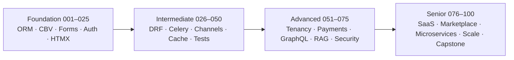

# django-100-projects

    

100 progressively harder Django projects. Goal: competent Django user → senior full-stack engineer who can architect, ship, and scale real products. Learning by building, not by tutorials.

- Full plan, dependency graph, skill matrix: [`ROADMAP.md`](./ROADMAP.md)
- Per-project spec: `NNN-slug/README.md` (19-section format)
- Every 5th project is a **flagship**: Docker, CI/CD, tests, observability, demo-ready

---

## Tiers

| Tier | Range | Focus |
|------|-------|-------|
| Foundation | 001–025 | ORM, CBVs, forms, auth, admin, templates, HTMX |
| Intermediate | 026–050 | DRF, Celery, Channels, caching, testing, i18n, first AI |
| Advanced | 051–075 | Multi-tenancy, payments, GraphQL, real-time, security, observability, RAG/agents |
| Senior | 076–100 | SaaS, marketplaces, microservices, scaling, ops, capstone |



## Curriculum Rules

- Numbered 001–100, never skipped.
- ≥25 real-world clones (currently 40), ≥15 AI projects (currently 16).
- Explicit coverage: SaaS, management, social, community, RBAC, permissions, multi-tenancy, audit logs.
- Each project declares exactly one stack (legend below).
- Non-goals: teaching React/TS/Node/Postgres basics; padding beyond 001–003; re-explaining a Django concept after its first appearance.

## Stack Legend

| Tag | Stack |
|-----|-------|
| HTMX | Django + Templates + HTMX |
| DRF+Vite | Django + DRF + React (Vite) |
| DRF+Next | Django + DRF + Next.js (App Router, TS) |
| Channels | Django + Channels + React |
| DRF+AI | Django + DRF + OpenAI / HuggingFace |
| Celery | Django + Celery + Redis |
| GraphQL | Django + Graphene / Strawberry |

## Repo Layout

```text
django-100-projects/
├── README.md
├── ROADMAP.md
├── .pre-commit-config.yaml
├── .github/workflows/          # shared CI templates
├── 001-notes-app/
│   ├── manage.py
│   ├── pyproject.toml          # or requirements.txt
│   ├── .env.example
│   ├── docker-compose.yml      # from 011 onward; flagships from 005
│   ├── Makefile
│   ├── README.md               # 19-section spec
│   └── ARCHITECTURE.md         # flagships only
├── 002-bookmark-vault/
└── …
```

Each project is self-contained: own `manage.py`, own dependencies, own env. No cross-project imports.

## Conventions

| Area | Rule |
|------|------|
| Runtime | Python 3.12, Django 5.x |
| Database | Postgres. SQLite allowed through 010 except flagships 005 and 010 (Postgres via Compose) |
| Tests | pytest-django + factory_boy; hypothesis where the spec calls for it; 80% coverage gate on flagships |
| Lint/format | ruff + black + isort, enforced by pre-commit |
| Config | `.env` + `django-environ`; never hardcode secrets; ship `.env.example` |
| Commits | Conventional Commits: `feat(003): todo list with CBVs` |
| Branches | `main` + short-lived `feat/NNN-slug` branches, one per project |
| Docs | Every project ships a README; every flagship also ships `ARCHITECTURE.md` |
| Observability | structlog + Sentry; Django Debug Toolbar in dev only |

## Baseline Tooling

**Makefile targets** (every project):

| Target | Action |
|--------|--------|
| `make install` | Install dependencies |
| `make migrate` | Apply migrations |
| `make run` | Dev server |
| `make test` | pytest with coverage |
| `make lint` | ruff + black --check + isort --check |
| `make fmt` | Auto-format |
| `make docker-up` / `make docker-down` | Compose stack up/down |
| `make deploy-check` | `manage.py check --deploy` + migration drift check |

**docker-compose services:** `web` (Django) · `db` (Postgres) · `redis` · `worker` (Celery) · `beat` · optional `nginx`.

**CI (GitHub Actions):** lint → test → coverage gate → `makemigrations --check` → build image.

## Quick Start

```bash
cd 001-notes-app
cp .env.example .env
make install
make migrate
make run
# or
make docker-up
```

## Master Roadmap

Status: ⬜ not started · 🟡 in progress · 🟢 done · ⭐ flagship

### Foundation (001–025)

| # | Project | Stack | Type | ⭐ | Status |
|---|---------|-------|------|----|--------|
| 001 | [Notes App](./001-notes-app) | HTMX | Core | | ⬜ |
| 002 | [Bookmark Vault](./002-bookmark-vault) | HTMX | Core | | ⬜ |
| 003 | [Todo with CBVs](./003-todo-with-cbvs) | HTMX | Core | | ⬜ |
| 004 | [Custom User Auth Portal](./004-custom-user-auth-portal) | HTMX | Core | | ⬜ |
| 005 | [Medium Clone](./005-medium-clone) | HTMX | Clone | ⭐ | ⬜ |
| 006 | [Expense Tracker](./006-expense-tracker) | HTMX | Core | | ⬜ |
| 007 | [Recipe Book](./007-recipe-book) | HTMX | Core | | ⬜ |
| 008 | [Hacker News Clone](./008-hacker-news-clone) | HTMX | Clone | | ⬜ |
| 009 | [Library Admin Console](./009-library-admin-console) | HTMX | Management | | ⬜ |
| 010 | [Craigslist Clone](./010-craigslist-clone) | HTMX | Clone | ⭐ | ⬜ |
| 011 | [Survey Builder](./011-survey-builder) | HTMX | Core | | ⬜ |
| 012 | [Follow Graph Feed](./012-follow-graph-feed) | HTMX | Social | | ⬜ |
| 013 | [Product Hunt Clone](./013-product-hunt-clone) | HTMX | Clone | | ⬜ |
| 014 | [Trello Clone](./014-trello-clone) | HTMX | Clone | | ⬜ |
| 015 | [Indeed Clone](./015-indeed-clone) | HTMX | Clone | ⭐ | ⬜ |
| 016 | [Threaded Forum](./016-threaded-forum) | HTMX | Community | | ⬜ |
| 017 | [Staff Portal Groups](./017-staff-portal-groups) | HTMX | RBAC | | ⬜ |
| 018 | [Team Docs Object Perms](./018-team-docs-object-perms) | HTMX | RBAC | | ⬜ |
| 019 | [Dropbox Clone](./019-dropbox-clone) | Celery | Clone | | ⬜ |
| 020 | [Instagram Clone](./020-instagram-clone) | HTMX | Clone | ⭐ | ⬜ |
| 021 | [Yelp Clone](./021-yelp-clone) | HTMX | Clone | | ⬜ |
| 022 | [Wiki Engine](./022-wiki-engine) | HTMX | Core | | ⬜ |
| 023 | [Inventory Audit Trail](./023-inventory-audit-trail) | HTMX | Management | | ⬜ |
| 024 | [Habit Tracker API](./024-habit-tracker-api) | DRF+Vite | Core | | ⬜ |
| 025 | [Stack Overflow Clone](./025-stack-overflow-clone) | HTMX | Clone | ⭐ | ⬜ |

### Intermediate (026–050)

| # | Project | Stack | Type | ⭐ | Status |
|---|---------|-------|------|----|--------|
| 026 | [Twitter/X Clone](./026-twitter-x-clone) | DRF+Vite | Clone | | ⬜ |
| 027 | [JWT Auth Gateway](./027-jwt-auth-gateway) | DRF+Next | Core | | ⬜ |
| 028 | [Catalog API](./028-catalog-api) | DRF+Next | Core | | ⬜ |
| 029 | [Report Digest Engine](./029-report-digest-engine) | Celery | Core | | ⬜ |
| 030 | [Uptime Monitor & Status Page](./030-uptime-monitor-status-page) | Celery | DevOps | ⭐ | ⬜ |
| 031 | [Notion Clone](./031-notion-clone) | DRF+Next | Clone | | ⬜ |
| 032 | [Slack Clone](./032-slack-clone) | Channels | Clone | | ⬜ |
| 033 | [Notifications Hub](./033-notifications-hub) | Channels | Core | | ⬜ |
| 034 | [Reddit Clone](./034-reddit-clone) | HTMX | Clone | | ⬜ |
| 035 | [Calendly Clone](./035-calendly-clone) | DRF+Next | Clone | ⭐ | ⬜ |
| 036 | [Double-Entry Ledger](./036-double-entry-ledger) | HTMX | Core | | ⬜ |
| 037 | [Etsy Clone](./037-etsy-clone) | HTMX | Clone | | ⬜ |
| 038 | [Spotify Clone](./038-spotify-clone) | DRF+Vite | Clone | | ⬜ |
| 039 | [YouTube Clone](./039-youtube-clone) | Celery | Clone | | ⬜ |
| 040 | [Airbnb Clone](./040-airbnb-clone) | DRF+Next | Clone | ⭐ | ⬜ |
| 041 | [Duolingo Clone](./041-duolingo-clone) | DRF+Vite | Clone | | ⬜ |
| 042 | [Udemy Clone](./042-udemy-clone) | HTMX | Clone | | ⬜ |
| 043 | [Library GraphQL](./043-library-graphql) | GraphQL | Core | | ⬜ |
| 044 | [Streaming AI Chat](./044-streaming-ai-chat) | DRF+AI | AI | | ⬜ |
| 045 | [Chat-with-PDFs](./045-chat-with-pdfs) | DRF+AI | AI | ⭐ | ⬜ |
| 046 | [Airtable Clone](./046-airtable-clone) | DRF+Vite | Clone | | ⬜ |
| 047 | [Semantic Search](./047-semantic-search) | DRF+AI | AI | | ⬜ |
| 048 | [AppSec Lab](./048-appsec-lab) | HTMX | Core | | ⬜ |
| 049 | [Stripe Dashboard Clone](./049-stripe-dashboard-clone) | DRF+Vite | Clone | | ⬜ |
| 050 | [Linear Clone](./050-linear-clone) | Channels | Clone | ⭐ | ⬜ |

### Advanced (051–075)

| # | Project | Stack | Type | ⭐ | Status |
|---|---------|-------|------|----|--------|
| 051 | [Shared-DB Tenancy](./051-shared-db-tenancy) | HTMX | SaaS | | ⬜ |
| 052 | [Schema Tenancy Helpdesk](./052-schema-tenancy-helpdesk) | HTMX | SaaS | | ⬜ |
| 053 | [RBAC Policy Engine](./053-rbac-policy-engine) | DRF+Vite | RBAC | | ⬜ |
| 054 | [Audit Log Platform](./054-audit-log-platform) | Celery | RBAC | | ⬜ |
| 055 | [Patreon Clone](./055-patreon-clone) | DRF+Next | Clone | ⭐ | ⬜ |
| 056 | [Shopify Clone](./056-shopify-clone) | DRF+Next | Clone | | ⬜ |
| 057 | [Usage Billing Engine](./057-usage-billing-engine) | Celery | SaaS | | ⬜ |
| 058 | [GitHub Clone](./058-github-clone) | DRF+Vite | Clone | | ⬜ |
| 059 | [GitLab CI Clone](./059-gitlab-ci-clone) | Celery | Clone | | ⬜ |
| 060 | [Jira Clone](./060-jira-clone) | DRF+Vite | Clone | ⭐ | ⬜ |
| 061 | [Discord Clone](./061-discord-clone) | Channels | Clone | | ⬜ |
| 062 | [Moderation Queue](./062-moderation-queue) | Channels | Community | | ⬜ |
| 063 | [Multi-Doc Q&A](./063-multi-doc-qa) | DRF+AI | AI | | ⬜ |
| 064 | [Support Copilot Agent](./064-support-copilot-agent) | DRF+AI | AI | | ⬜ |
| 065 | [Tenant RAG Knowledge Base](./065-tenant-rag-knowledge-base) | DRF+AI | AI | ⭐ | ⬜ |
| 066 | [LLM Evals Harness](./066-llm-evals-harness) | Celery | AI | | ⬜ |
| 067 | [Guardrails Pipeline](./067-guardrails-pipeline) | DRF+AI | AI | | ⬜ |
| 068 | [Multimodal Search](./068-multimodal-search) | DRF+AI | AI | | ⬜ |
| 069 | [Amazon Clone GraphQL](./069-amazon-clone-graphql) | GraphQL | Clone | | ⬜ |
| 070 | [Vercel Dashboard Clone](./070-vercel-dashboard-clone) | Channels | Clone | ⭐ | ⬜ |
| 071 | [Google Drive Clone](./071-google-drive-clone) | DRF+Next | Clone | | ⬜ |
| 072 | [Gmail Clone](./072-gmail-clone) | DRF+Vite | Clone | | ⬜ |
| 073 | [Recommendation Engine](./073-recommendation-engine) | DRF+AI | AI | | ⬜ |
| 074 | [Zillow Clone](./074-zillow-clone) | DRF+Next | Clone | | ⬜ |
| 075 | [Uber Clone](./075-uber-clone) | Channels | Clone | ⭐ | ⬜ |

### Senior (076–100)

| # | Project | Stack | Type | ⭐ | Status |
|---|---------|-------|------|----|--------|
| 076 | [Feed Fan-out Engine](./076-feed-fan-out-engine) | Celery | Social | | ⬜ |
| 077 | [Substack Clone](./077-substack-clone) | HTMX | Clone | | ⬜ |
| 078 | [Multi-Tenant CRM](./078-multi-tenant-crm) | DRF+Vite | SaaS | | ⬜ |
| 079 | [Feature Flags Platform](./079-feature-flags-platform) | DRF+Vite | SaaS | | ⬜ |
| 080 | [Auction Marketplace](./080-auction-marketplace) | Channels | Marketplace | ⭐ | ⬜ |
| 081 | [Freelance Escrow Marketplace](./081-freelance-escrow-marketplace) | DRF+Next | Marketplace | | ⬜ |
| 082 | [Agent Workflow Platform](./082-agent-workflow-platform) | Celery | AI | | ⬜ |
| 083 | [Fine-Tuning Pipeline](./083-fine-tuning-pipeline) | DRF+AI | AI | | ⬜ |
| 084 | [PR Review Bot](./084-pr-review-bot) | DRF+AI | AI | | ⬜ |
| 085 | [AI Support SaaS](./085-ai-support-saas) | DRF+Next | AI | ⭐ | ⬜ |
| 086 | [Outbox Event Bus](./086-outbox-event-bus) | Celery | DevOps | | ⬜ |
| 087 | [API Gateway Contracts](./087-api-gateway-contracts) | DRF+Vite | DevOps | | ⬜ |
| 088 | [Postgres Scale Lab](./088-postgres-scale-lab) | HTMX | DevOps | | ⬜ |
| 089 | [Load Testing Lab](./089-load-testing-lab) | Celery | DevOps | | ⬜ |
| 090 | [Auth0 Clone](./090-auth0-clone) | DRF+Next | Clone | ⭐ | ⬜ |
| 091 | [Supabase Clone](./091-supabase-clone) | DRF+Vite | Clone | | ⬜ |
| 092 | [Meeting Notes AI](./092-meeting-notes-ai) | Celery | AI | | ⬜ |
| 093 | [Ops Console](./093-ops-console) | HTMX | Management | | ⬜ |
| 094 | [HR Payroll Suite](./094-hr-payroll-suite) | HTMX | Management | | ⬜ |
| 095 | [Production Hardening](./095-production-hardening) | Celery | DevOps | ⭐ | ⬜ |
| 096 | [Product Analytics SaaS](./096-product-analytics-saas) | Celery | SaaS | | ⬜ |
| 097 | [Text-to-SQL Analyst](./097-text-to-sql-analyst) | DRF+AI | AI | | ⬜ |
| 098 | [Figma Comments Clone](./098-figma-comments-clone) | Channels | Clone | | ⬜ |
| 099 | [Compliance Toolkit](./099-compliance-toolkit) | DRF+Vite | RBAC | | ⬜ |
| 100 | [Capstone SaaS](./100-capstone-saas) | DRF+Next | Capstone | ⭐ | ⬜ |

## Progress Tracker

| Tier | Range | Done | Total | Progress |
|------|-------|------|-------|----------|
| Foundation | 001–025 | 0 | 25 | ░░░░░░░░░░ 0% |
| Intermediate | 026–050 | 0 | 25 | ░░░░░░░░░░ 0% |
| Advanced | 051–075 | 0 | 25 | ░░░░░░░░░░ 0% |
| Senior | 076–100 | 0 | 25 | ░░░░░░░░░░ 0% |
| **Total** | 001–100 | **0** | **100** | ░░░░░░░░░░ 0% |

**Active project:** none

### Flagship Checklist

- [ ] 005 Medium Clone
- [ ] 010 Craigslist Clone
- [ ] 015 Indeed Clone
- [ ] 020 Instagram Clone
- [ ] 025 Stack Overflow Clone
- [ ] 030 Uptime Monitor & Status Page
- [ ] 035 Calendly Clone
- [ ] 040 Airbnb Clone
- [ ] 045 Chat-with-PDFs
- [ ] 050 Linear Clone
- [ ] 055 Patreon Clone
- [ ] 060 Jira Clone
- [ ] 065 Tenant RAG Knowledge Base
- [ ] 070 Vercel Dashboard Clone
- [ ] 075 Uber Clone
- [ ] 080 Auction Marketplace
- [ ] 085 AI Support SaaS
- [ ] 090 Auth0 Clone
- [ ] 095 Production Hardening
- [ ] 100 Capstone SaaS

**Flagship gate:** Docker + Compose · CI green · ≥80% coverage · `ARCHITECTURE.md` · structlog + Sentry wired · public-demo-ready.

## Coverage Map

| Theme | Projects |
|-------|----------|
| Clones (40) | 005 008 010 013 014 015 019 020 021 025 026 031 032 034 035 037 038 039 040 041 042 046 049 050 055 056 058 059 060 061 069 070 071 072 074 075 077 090 091 098 |
| AI (16) | 044 045 047 063 064 065 066 067 068 073 082 083 084 085 092 097 |
| SaaS | 051 052 057 078 079 096 |
| Multi-tenancy | 051 052 056 065 078 085 090 094 096 100 |
| RBAC / permissions | 017 018 053 054 099 (+ 060 090) |
| Audit logs | 023 054 060 090 099 100 |
| Social / community | 012 016 062 076 (+ clones 008 013 020 025 026 034 061) |
| Management | 009 023 093 094 |
| Marketplace | 080 081 (+ 037 040 056 075) |
| Payments / Stripe | 049 055 056 057 081 100 |
| GraphQL | 043 069 |
| DevOps / scale / observability | 030 070 086 087 088 089 095 |

## Session Cues

| Cue | Effect |
|-----|--------|
| `continue` | Resume generation from the last stopped project |
| `regenerate NNN` | Rebuild only that project's README, same format |
| `freeze style` | Lock format/tone from the latest project for all future ones |
| `interview NNN` | 10 mock interview questions on skills up to NNN |
| `sprint review NNN–MMM` | Checklist + portfolio artifact summary |

## Updating Progress

1. Flip the status cell in the tier table (⬜ → 🟡 → 🟢) and tick the flagship box where applicable.
2. Update the tier counts and progress bar.
3. Update the badges at the top (`projects-N%2F100`, `flagships-N%2F20`).
4. Commit: `docs(readme): mark NNN done`.
